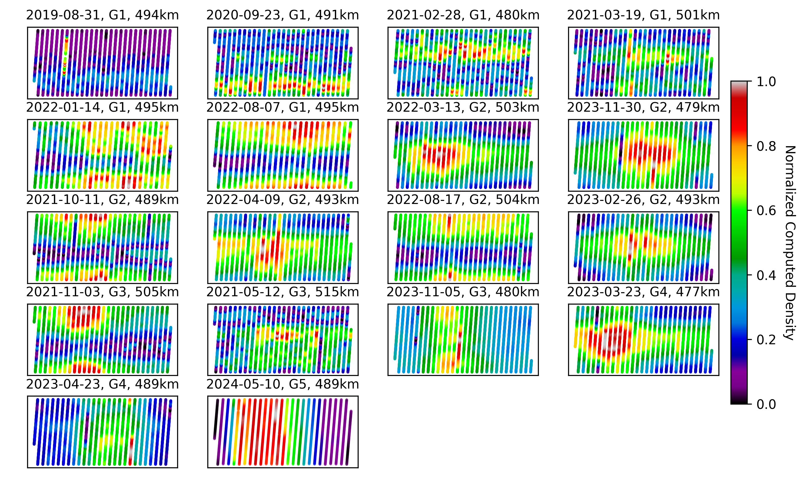
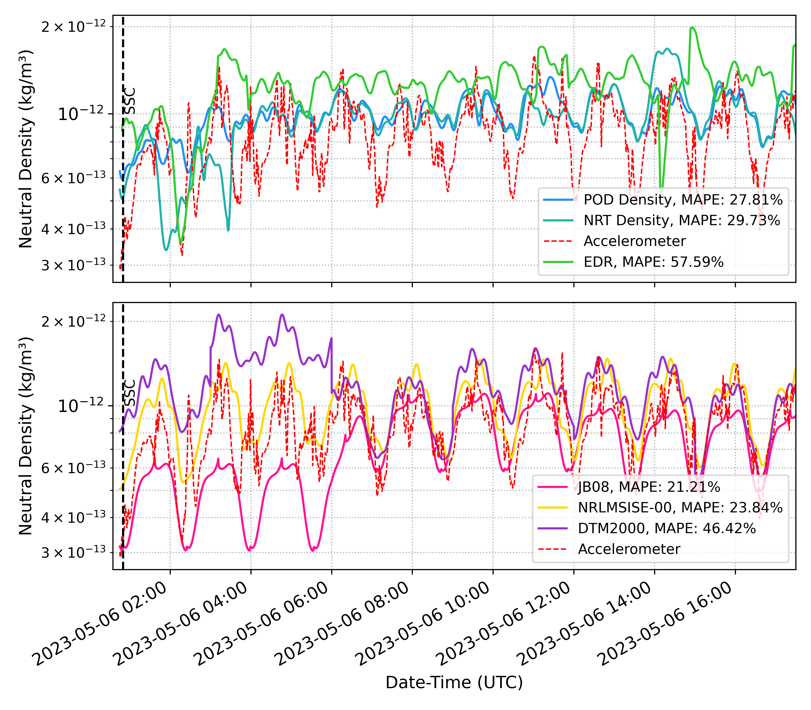
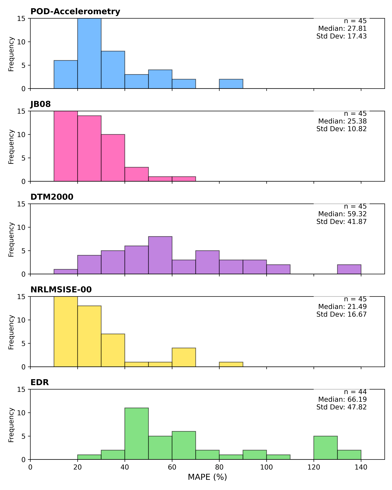
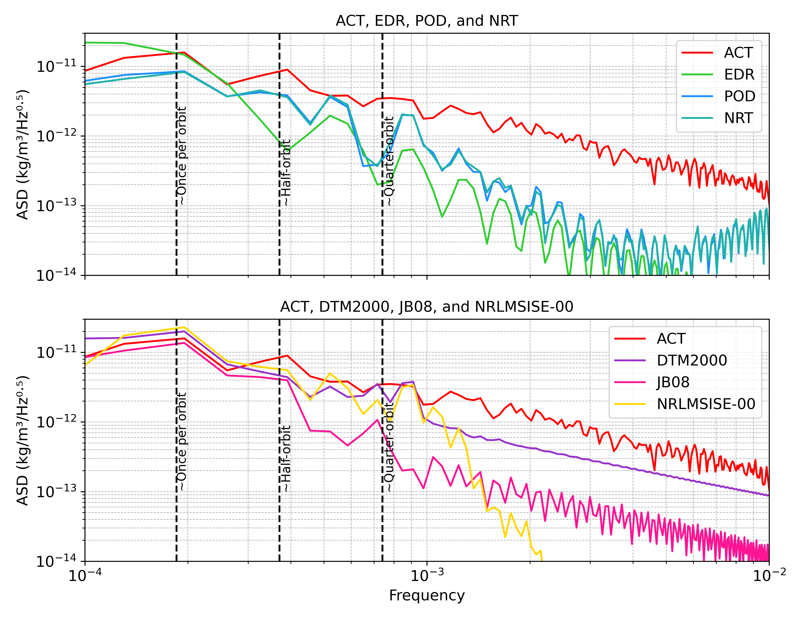
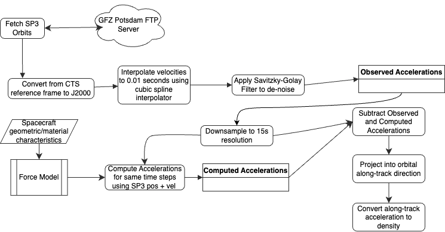

<p align="center">
  <br/>
</p>

<h1 align="center">Evaluating Near-Real Time Thermospheric Density Retrieval Methods from Precise Low Earth Orbit Spacecraft Ephemerides During Geomagnetic Storms</h1>

<p align="center">
    This repository contains the supporting code for the paper "<em>Evaluating Near-Real Time Thermospheric Density Retrieval Methods from Precise Low Earth Orbit Spacecraft Ephemerides During Geomagnetic Storms</em>" by Charles Constant, Santosh Bhattarai, Indigo Brownhall, Anasuya Aruliah, and Marek Zeibart (2024).
  <br />
  <a href="https://github.com/CharlesPlusC/PODDensity/issues">Report Issues</a>
  ·
  <a href="https://github.com/CharlesPlusC/PODDensity/pulls">Request Features</a>
</p>

## Introduction

This repository provides a suite of tools for the processing and analysis of precise ephemeris data to derive thermospheric densities during geomagnetic storms.

## Key Features

- **Data Acquisition**: Automated scripts to fetch SP3 orbit files from the GFZ Potsdam FTP server, convert them into continuous ephemerides, and transform the data to the inertial frame (J2000/EME2000). See `Get_SP3_from_GFZ_FTP.py` for implementation details.
- **Density Inversion**: Core routines to perform density inversion from satellite ephemerides, as detailed in `source/DensityInversion/PODDensity.py` and `source/DensityInversion/EDRDensity.py`.
- **Batch Processing**: The `StormTimeDensity.py` script enables batch processing of multiple geomagnetic storms, facilitating density inversion on compute clusters.
- **Space Weather Indices**: Scripts for identifying and categorizing geomagnetic storms based on space weather indices are available in `SWIndices.py`, which includes methods to process data for the entire operational lifetime of each satellite.

## Reproducing the Paper's Results

To replicate the figures and results presented in the paper, execute the following commands from the root directory:

```bash
python -m source.DensityInversion.Plotting.{}.py
```

where `{}` is the name of the script to run. For example, to generate the density inversion plots comparing all methods on the same storm, run:

```bash
python -m source.DensityInversion.Plotting.AllMethods1Storm.py
```

## Outputs

This repository allows the reproduction of all figures included in the paper, along with additional plots that provide further insights. Examples of the generated outputs are illustrated below:

### Comparison of POD-Derived Densities to Model Densities Across All Available Storms

<p align="center">
  
</p>

### Relative POD Density for Each Storm as a Function of Argument Latitude and Time

<p align="center">
  
</p>

### Time Series of POD-Derived Densities and Model Densities for a Single Storm

<p align="center">
  
</p>

### Histogram Comparing MAPE of each method against accelerometer derived densities

<p align="center">
  
</p>

### Amplitude Spectral Density of Accelerometer Data for Each Method

<p align="center">
  
</p>

## System Overview

The system is designed for deployment on a compute cluster and is structured as follows:

<p align="center">
  
</p>

## Environment Setup

To set up the environment required to run the code, follow these steps:

1. Clone the repository:
   ```bash
   git clone https://github.com/CharlesPlusC/PODDensity.git
   cd PODDensity
   ```

2. Install the required packages using the provided environment file:
   ```bash
   conda env create -f pod_density_env.yml
   ```

3. Activate the environment:
   ```bash
   conda activate pod_density_env
   ```

4. Run the scripts as described above to reproduce the results.

## Invitation to Collaborate

We welcome and encourage contributions and collaborations from researchers, engineers, and enthusiasts who are interested in advancing the fields of space weather modeling and satellite operations.
If you would like to contribute or collaborate, please feel free to fork the repository or raise an issue with a description of your proposal or question. I will review and respond to all inquiries as promptly as possible.

Thank you for your interest and support!
