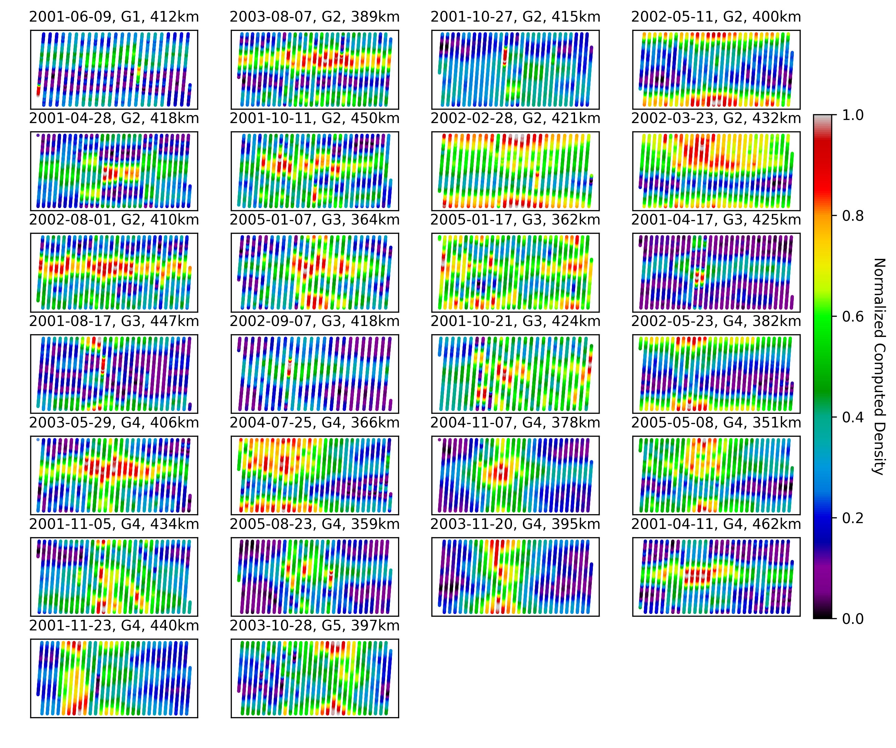
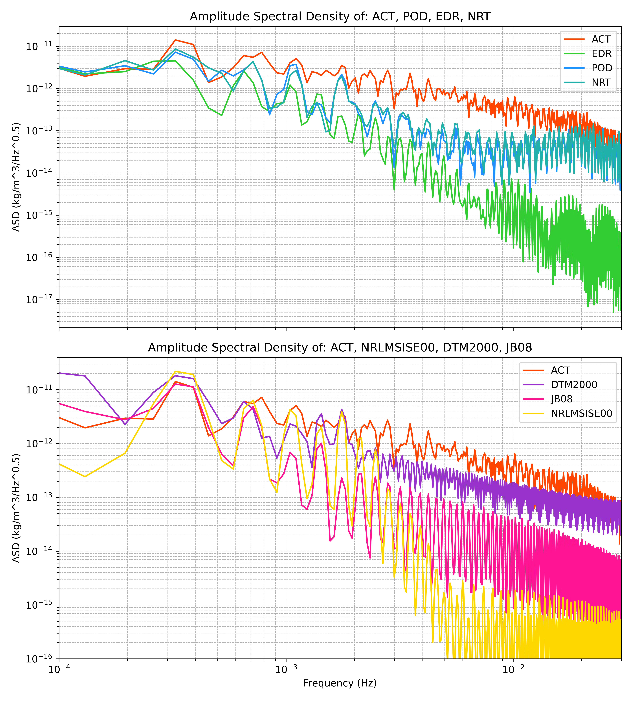
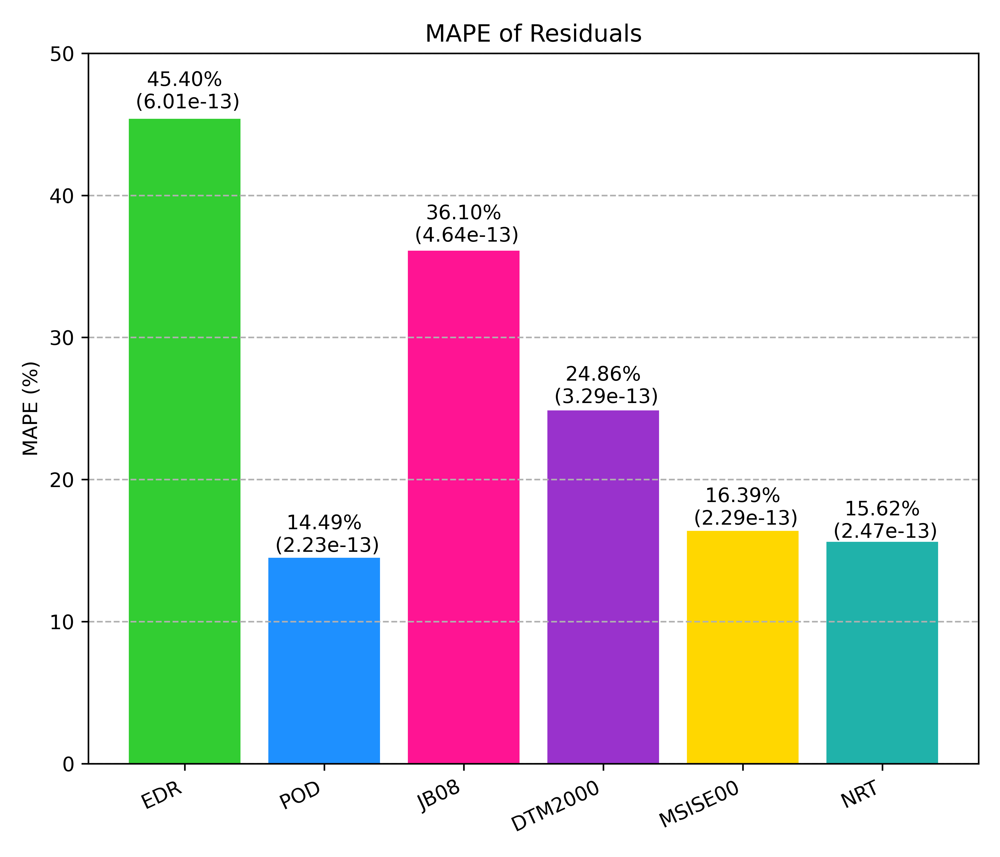

[](http://hits.dwyl.com/CharlesPlusC/PODDensity)

<p align="center">
  <br/>
  
</p>

<h2 align="center">POD Density Inversion</h2>

<p align="center">
    This repository contains the code accompanying the paper "Real-Time Thermospheric Density Retrieval from Low Earth Orbit Spacecraft Ephemerides During Geomagnetic Storms" by Charles Constant, Santosh Bhattarai, Indigo Brownhall, Anasuya Aruliah, and Marek Zeibart (2024).
  <br />
  <a href="https://github.com/CharlesPlusC/PODDensity/issues">Report a Bug</a>
  ·
  <a href="https://github.com/CharlesPlusC/PODDensity/pulls">Request a Feature</a>
</p>

## Overview

This repository provides tools for processing precise ephemeris data to retrieve thermospheric densities during geomagnetic storms. The main functionalities include:

- **Data Acquisition:** Scripts to retrieve SP3 orbit files from the GFZ Potsdam FTP server (`Get_SP3_from_GFZ_FTP.py`), merge them into continuous ephemerides, convert them to the inertial frame (J2000/EME2000)
- **Density Inversion:** Scripts to perform density inversion (`source/DensityInversion/PODDensity.py`).
- **Branches:** 
  - The `main` branch contains the complete codebase, including estimated densities for CHAMP, TerraSAR-X, and GRACE-FO-A, as well as scripts to reproduce the paper's results.
  - The `lite` branch is identical but excludes the `SWindices` folder (~2 GB of space weather index data), which is used for plotting indices in the paper.
- **Batch Processing:** The `Storm Time Density` script allows for simultaneous density inversion across multiple storms listed in `misc/selected_storms.txt` on a compute cluster.
- **Space Weather Indices:** `SWIndices.py` contains code to identify and categorize all geomagnetic storms during the operational lifetime of each satellite studied.
- **Computation Libraries:** The Orekit Python Wrapper is used extensively for force modeling, frame transformations, and density model computations.

## Reproducing the Paper's Results

To replicate the figures presented in the paper, run the following commands from the root directory:

```bash
python -m source.DensityInversion.GFOAccelerometryBenchmark
python -m source.DensityInversion.Plotting.PODDensityPlotting
```

## Outputs:
The following repo will enable you to replicate all figures in the paper (and a number of others that were not included for brevity). As a quick illustration of the capabilities contained some example are included below.

__Comparison of POD-Derived Densities to Model Densities Across All Available Storms__


__Relative POD Density for Each Storm As A Function of Argument Latitude and Time__


__Time Series of POD-Derived Densities and Model Densities for a Single Storm__


__Time Series Benchmarking of All Studied Methods Against Accelerometer Data__


__Amplitude Spectral Density of Accelerometer Data for Each Method__


__Mean Absolute Percentage Error and Root Mean Square Error of Each Method__


## System Overview:
The system is designed to be run on a compute cluster, with the following structure:


## Environment Activation
1. Clone the repository
2. Install the requirements using the megeaconst_env.yml file:
``` bash
conda env create -f pod_density_env.yml
```
3. Activate the environment:
``` bash
 conda activate pod_density_env
```
4. Run the code as described above.