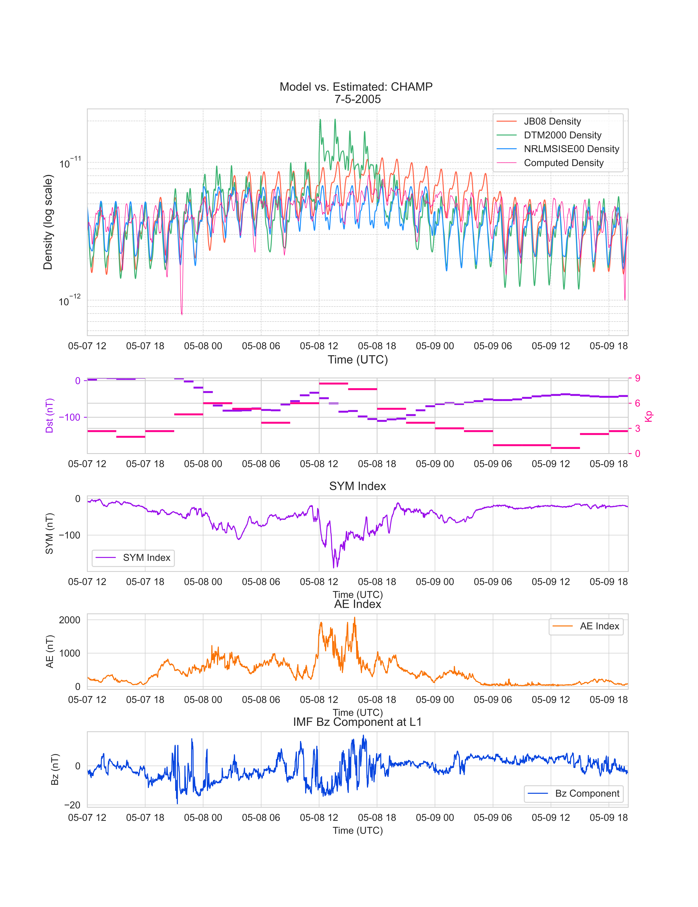

[](http://hits.dwyl.com/CharlesPlusC/PODDensity)

<p align="center">
  <br/>
  
</p>

<h3 align="center">POD Density Inversion</h3>

<p align="center">
    This repo contains code accompanying the paper "Real-Time Thermospheric Density Retrieval from Low Earth Orbit Spacecraft Ephemerides During Geomagnetic Storms" by Charles Constant, Santosh Bhattarai, Indigo Brownhall, Anasuya Aruliah and Marek Zeibart (2024).
  <br />
  <a href="https://github.com/CharlesPlusC/PODDensity/issues">Report Bug</a>
  ·
  <a href="https://github.com/CharlesPlusC/PODDensity/pulls">Request Feature</a>
</p>

- The repo contains tools to pull SP3 orboits from GFZ potsdam FTP (`Get_SP3_from_GFZ_FTP.py`), merge the files into continuous ephemerides and convert them to an interial-frame (J2000/EME2000) and perform density inversion on these (`source/DensityInversion/PODDensity.py`).
- The underlying library used for many of the computations (force modelling/frame transformations/ density model calls) is the Orekit Python Wrapper, which is a Python wrapper for the Orekit Java library.
- The repo comes in 2 branches. The main branch contains the code, the estimated densities for CHAMP, TerraSAR-X and GRACE-A (in output/DensityInversion/PODDensityInversion/Data/StormAnalysis)and the code to reproduce the results in the paper. The `lite' branch is identical but does not contain the SWindices folder (~2Gb of data) which are used to plots containing space weather indices in the paper.
- Storm Time Density provides a script to perform the denstiy inversion on a compute cluster for all storm specified in `misc/selected_storms.txt' simultaneously.
- SWIndices.py contains code to idenify and categorize all storms during the lifetime of each satellite studied.

- The figures in the paper can be replicated by running the following from root:
```zsh
python -m source.DensityInversion.GFOAccelerometryBenchmark
python -m source.DensityInversion.Plotting.PODDensityPlotting
```

## Outputs:
The following repo will enable you to replicate all figures in the paper (and a number of others that were not included for brevity). As a quick illustration of the capabilities contained some example are included below.

__Comparison of POD-Derived Densities to Model Densities Across All Available Storms__


__Relative POD Density for Each Storm As A Function of Argument Latitude and Time__


__Time Series of POD-Derived Densities and Model Densities for a Single Storm__



__Time Series Benchmarking of All Studied Methods Against Accelerometer Data__


__Amplitude Spectral Density of Accelerometer Data for Each Method__


__Mean Absolute Percentage Error and Root Mean Square Error of Each Method__


## Environment Activation
1. Clone the repository
2. Install the requirements using the megeaconst_env.yml file:
``` bash
conda env create -f pod_density_env.yml
```
3. Activate the environment:
``` bash
 conda activate pod_density_env
```
4. Run the code as described above.